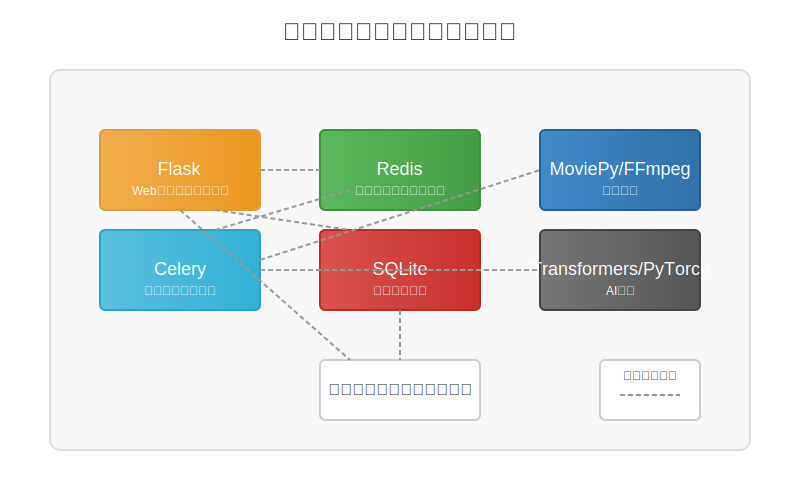
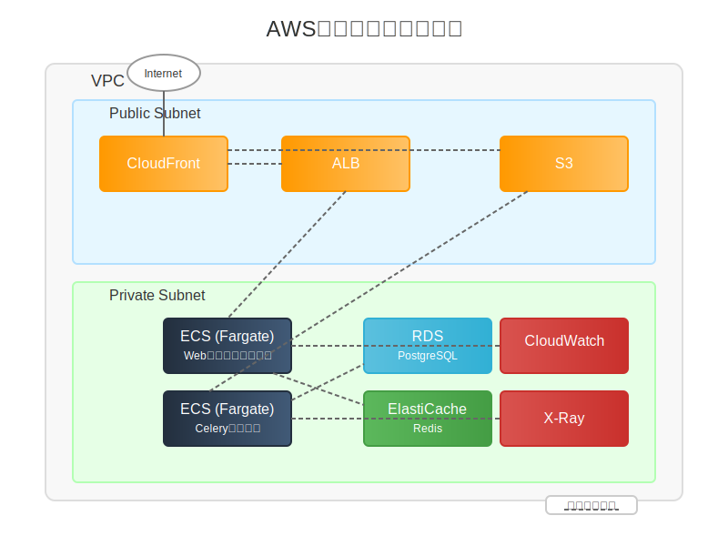

# AI切り抜きくん (AI-kirinuki-kun)

YouTubeの動画をAIで自動解析し、重要なシーンを切り抜いた動画を作成するWebアプリケーションです。

## 機能

- YouTubeの動画URLからの自動ダウンロード
- AIによる動画解析と重要シーンの抽出
- 切り抜き動画の自動生成
- 生成された動画のプレビューとダウンロード
- 処理履歴の管理と再生成

## アーキテクチャ

### ローカル環境



- **Flask**: Webアプリケーションフレームワーク
- **Celery**: 非同期タスク処理
- **Redis**: メッセージブローカー
- **SQLite**: データベース
- **MoviePy/FFmpeg**: 動画処理
- **Transformers/PyTorch**: AI解析

### AWS環境 



#### 主要コンポーネント

1. **コンピュート**
   - **ECS (Fargate)**: コンテナ化されたアプリケーション実行環境
     - Webアプリケーションコンテナ
     - Celeryワーカーコンテナ

2. **データベース**
   - **RDS (PostgreSQL)**: スケーラブルなリレーショナルデータベース

3. **メッセージングとキャッシュ**
   - **ElastiCache (Redis)**: Celeryのメッセージブローカー

4. **ストレージ**
   - **S3**: 動画ファイル保存（原本・生成動画）

5. **配信**
   - **CloudFront**: 動画配信CDN
   - **ALB**: ロードバランサー

6. **モニタリング**
   - **CloudWatch**: メトリクス・ログ監視
   - **X-Ray**: 分散トレーシング

#### スケーリング戦略

- **Webアプリケーション**: CPUとメモリ使用率によるオートスケーリング
- **Celeryワーカー**: キュー長に基づくスケーリング
- **動画処理**: GPUインスタンスの利用（重い処理向け）

#### セキュリティ設計

- VPC内の適切なサブネット分離
- セキュリティグループによるアクセス制御
- S3とRDSの暗号化
- HTTPS通信の強制

#### コスト最適化

- Fargate Spotインスタンスの活用（ワーカー処理）
- S3 Intelligent-Tieringによるストレージコスト最適化
- CloudFrontキャッシュによる転送コスト削減

## セットアップ方法

### ローカル環境

#### 前提条件

- Python 3.8以上
- FFmpeg（動画処理と音声認識に必要）
- Redis（Celeryのメッセージブローカーとして使用）

##### FFmpegのインストール方法

###### Ubuntu / Debian
```bash
sudo apt-get update
sudo apt-get install ffmpeg
```

###### CentOS / RHEL
```bash
sudo yum install ffmpeg
```

###### macOS (Homebrew)
```bash
brew install ffmpeg
```

###### Windows
[FFmpegの公式サイト](https://ffmpeg.org/download.html)からダウンロードするか、Chocolateyを使用:
```bash
choco install ffmpeg
```

#### インストール

1. リポジトリをクローン
   ```
   git clone https://github.com/yourusername/AI-kirinuki-kun.git
   cd AI-kirinuki-kun
   ```

2. 仮想環境を作成して有効化
   ```
   python -m venv venv
   source venv/bin/activate  # Linuxの場合
   venv\Scripts\activate     # Windowsの場合
   ```

3. 依存関係のインストール
   ```
   pip install -r requirements.txt
   ```

4. 環境変数の設定
   ```
   cp .env.example .env
   ```
   `.env`ファイルを編集して必要な環境変数を設定してください。

#### 実行方法

1. Redisサーバーを起動（別のターミナルで）
   ```
   redis-server
   ```

2. Celeryワーカーを起動（別のターミナルで）
   ```
   celery -A celery_worker.celery worker --loglevel=info
   ```

3. アプリケーションを起動
   ```
   python run.py
   ```

4. ブラウザで http://localhost:5000 にアクセス

### AWS環境

#### 前提条件

- AWS CLI
- Docker
- Terraform (または CloudFormation)

#### デプロイ手順概要

1. ECRリポジトリの作成とDockerイメージのビルド・プッシュ
   ```
   # ECRリポジトリ作成
   aws ecr create-repository --repository-name ai-kirinuki-app
   aws ecr create-repository --repository-name ai-kirinuki-worker
   
   # ログイン
   aws ecr get-login-password | docker login --username AWS --password-stdin <your-aws-account-id>.dkr.ecr.<region>.amazonaws.com
   
   # イメージビルド & プッシュ
   docker build -t <your-aws-account-id>.dkr.ecr.<region>.amazonaws.com/ai-kirinuki-app:latest -f Dockerfile.app .
   docker build -t <your-aws-account-id>.dkr.ecr.<region>.amazonaws.com/ai-kirinuki-worker:latest -f Dockerfile.worker .
   
   docker push <your-aws-account-id>.dkr.ecr.<region>.amazonaws.com/ai-kirinuki-app:latest
   docker push <your-aws-account-id>.dkr.ecr.<region>.amazonaws.com/ai-kirinuki-worker:latest
   ```

2. インフラストラクチャのデプロイ
   ```
   cd terraform
   terraform init
   terraform apply
   ```

3. 環境変数の設定
   - AWS Systems Manager Parameter Storeに必要な環境変数を設定
   - ECSタスク定義で環境変数を参照

詳細は `docs/aws_deployment.md` を参照してください。

## 開発ガイド

### プロジェクト構成

```
AI-kirinuki-kun/
├── src/               # アプリケーションコード
│   ├── app.py         # Flaskアプリケーション
│   ├── tasks.py       # Celeryタスク定義
│   ├── models.py      # データモデル
│   └── ...
├── templates/         # HTMLテンプレート
├── static/            # 静的ファイル
├── uploads/           # アップロードされた動画（開発環境）
├── outputs/           # 生成された動画（開発環境）
├── docker/            # Dockerファイル
├── terraform/         # Terraformコード（AWS環境構築用）
├── docs/              # ドキュメント
└── ...
```

### CI/CD

AWS CodePipelineを使用した継続的デリバリーパイプラインを構築できます：

1. GitHub連携によるソースコード変更検知
2. CodeBuildでのDockerイメージビルド
3. ECRへのイメージプッシュ
4. ECSサービスの更新

詳細は `docs/cicd.md` を参照してください。

## 注意事項

- このアプリケーションは個人利用を目的としています。
- 著作権に配慮して使用してください。
- AWS環境での運用には、適切なリソース割り当てとコスト管理が必要です。
- 長い動画や高解像度動画の処理には、より多くのリソースが必要になります。

## ライセンス

MITライセンス